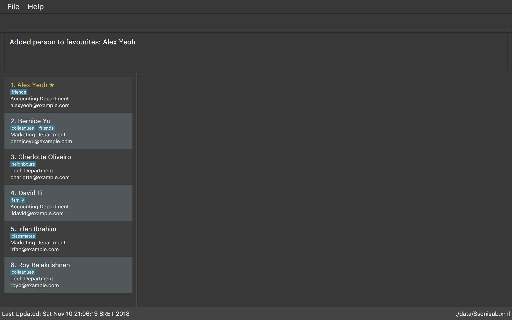

= SSENISUB
ifdef::env-github,env-browser[:relfileprefix: docs/]

https://travis-ci.org/CS2103-AY1819S1-T13-2/main[image:https://travis-ci.org/CS2103-AY1819S1-T13-2/main.svg?branch=master[Build Status]]
https://ci.appveyor.com/project/DanKhoo/main/branch/master[image:https://ci.appveyor.com/api/projects/status/pw5iprwm6q97wbo0/branch/master?svg=true[Build status]]
https://coveralls.io/github/CS2103-AY1819S1-T13-2/main?branch=master[image:https://coveralls.io/repos/github/CS2103-AY1819S1-T13-2/main/badge.svg?branch=master[Coverage Status]]
https://www.codacy.com/app/DanKhoo/main?utm_source=github.com&amp;utm_medium=referral&amp;utm_content=CS2103-AY1819S1-T13-2/main&amp;utm_campaign=Badge_Grade[image:https://api.codacy.com/project/badge/Grade/f88a4818748d488192c6ab654eb1caba[Codacy Badge]]
https://gitter.im/se-edu/Lobby[image:https://badges.gitter.im/se-edu/Lobby.svg[Gitter chat]]

ifdef::env-github[]

endif::[]

ifndef::env-github[]
image::images/Ui.png[width="600"]
endif::[]

* SSENISUB is a desktop application to assist the HR department of a company to manage its staff. On top of just assisting HR, this application also allows the staff themselves to view their workplace performance and improve themselves.
* It has a GUI but most of the user interactions happen using a CLI (Command Line Interface).
* SSENISUB also doubles as a contacts manager to allow staff to easily find the contact information of their superior or colleagues.
* Features of SSENISUB:
** Allows a staff to view contact information of their superiors and coworkers.
** Allow managers to rate and feedback on their staff's performance.
** Allows a HR staff to upload/edit contact information.

== Site Map

* <<UserGuide#, User Guide>>
* <<DeveloperGuide#, Developer Guide>>
* <<LearningOutcomes#, Learning Outcomes>>
* <<AboutUs#, About Us>>
* <<ContactUs#, Contact Us>>

== Acknowledgements

* Some parts of this sample application were inspired by the excellent http://code.makery.ch/library/javafx-8-tutorial/[Java FX tutorial] by
_Marco Jakob_.
* Libraries used: https://github.com/TestFX/TestFX[TextFX], https://bitbucket.org/controlsfx/controlsfx/[ControlsFX], https://github.com/FasterXML/jackson[Jackson], https://github.com/google/guava[Guava], https://github.com/junit-team/junit5[JUnit5]
* Original source code was adopted from https://github.com/se-edu/ (addressbook-level4)

== Licence : link:LICENSE[MIT]
